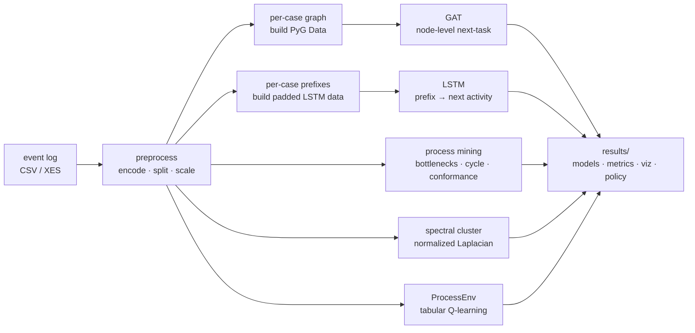

<div align="center">

```
   ┏━━━━━━━━━━━━━━━━━━━━━━━━━━━━━━━━━━━━━━━━━━━━━━━━━━━━━━━━━━━━┓
   ┃                                                              ┃
   ┃   ┏━━┓┏┓╻┏┓╻         process mining · graph attention        ┃
   ┃   ┃┏┓┃┃┗┫┃┗┫         lstm · spectral · tabular rl            ┃
   ┃   ┃┗┛┃╹ ╹╹ ╹         pm4py · pyo3 hot-paths · single CLI     ┃
   ┃   ┗━━┛                                                       ┃
   ┃                                                              ┃
   ┗━━━━━━━━━━━━━━━━━━━━━━━━━━━━━━━━━━━━━━━━━━━━━━━━━━━━━━━━━━━━┛
```

# **gnn** — process mining with graph neural networks

**Predict the next event. Find the bottleneck. Recommend the resource.**
One CLI, one event log, six questions answered.

[](https://github.com/erphq/gnn/actions/workflows/ci.yml)
[](https://github.com/erphq/gnn/actions/workflows/docker.yml)
[](./LICENSE)
[](#install)
[](./pm_fast)
[](./tests)
[](https://github.com/erphq/gnn/releases)

</div>

A modern toolkit for process mining that fuses classical algorithms — PM4Py
inductive miner, token-replay conformance, spectral clustering — with
**Graph Attention Networks**, **LSTMs**, and **tabular RL**, all wired
together by a single `gnn` CLI you can drop on any event log.

Built for the questions you actually ask: *where do cases get stuck?*,
*what happens next?*, *does reality match the discovered model?*,
*who should do the work?*

> **The thesis.** Process mining notebooks are easy to write and easy to
> get *subtly wrong* — leaky splits, scalers fit on validation, modal
> graph labels, complex-valued spectral. This repo's job is to be the
> opinionated, audited, batteries-included alternative: same algorithms,
> right by default, fast where it matters.

---

## ✦ Live demo

```text
$ gnn smoke
  ✓ data        80 cases · 624 events · 4 tasks
  ✓ split       64 train · 16 val (case-isolated)
  ✓ GAT         2 epochs · val_acc=0.81 · MCC=0.62
  ✓ LSTM        2 epochs · val_acc=0.79
  ✓ analyze     8 bottlenecks · 1 deviant trace · cycle95=14.3h
  ✓ cluster     3 spectral groups
  ✓ rl          policy over 12 states / 8 actions
  → results/run_20260429_143000/
```

That's the same `gnn smoke` command new contributors run before opening a
PR. Synthetic data, full pipeline, no internet, no GPU, ~60 seconds.

---

## ✦ Try it in 60 seconds

```bash
git clone https://github.com/erphq/gnn && cd gnn

python -m venv .venv && source .venv/bin/activate
pip install --index-url https://download.pytorch.org/whl/cpu torch
pip install -r requirements.txt && pip install -e .

gnn smoke      # synthetic data, full pipeline, no internet, no GPU
```

Trained GAT + LSTM weights, conformance reports, a Plotly Sankey, spectral
task clusters, and an RL policy — in under a minute.

Pointing at real data is one line:

```bash
gnn run input/BPI2020_DomesticDeclarations.csv
```

Don't want a Python env? Pull the image:

```bash
docker run --rm -it ghcr.io/erphq/gnn:main gnn smoke
```

---

## ✦ What `gnn` answers

Drop in an event log. Every release is required to answer all six of
these on the BPI 2020 sample without manual surgery:

| Question | Command | What you get |
|---|---|---|
| 🚦 **Where are the bottlenecks?** | `gnn analyze log.csv` | Top transitions by mean wait time |
| ⚠️  **Which cases are anomalous?** | `gnn analyze log.csv` | Cases above the 95th-percentile cycle time + rare paths |
| 🔮 **What happens next in this case?** | `gnn run log.csv` | GAT + LSTM next-activity probabilities |
| ✅ **Does reality match the model?** | `gnn analyze log.csv` | Per-trace conformance (inductive miner + token replay) |
| 👤 **How should resources be allocated?** | `gnn run log.csv` | Q-learning policy over `(task, resource)` |
| 🧬 **Are these activities really distinct?** | `gnn cluster log.csv -k 3` | Spectral clusters of the task adjacency |

---

## ✦ How it works



Stages are independently runnable (`gnn analyze`, `gnn cluster`) and
individually skippable (`--skip-{gat,lstm,analyze,viz,cluster,rl}`).
Output is one timestamped directory per run.

---

## ✦ Fast where it matters

The two per-case Python loops that dominated wall-clock time are now
Rust kernels (PyO3 + maturin). On a synthetic log of 5,000 cases / 37,651
rows on Apple silicon:

| function                   | Python    | Rust        | speedup  |
|----------------------------|-----------|-------------|----------|
| `build_task_adjacency`     | 396.31 ms | **0.67 ms** | **588×** |
| `build_padded_prefixes`    | 396.27 ms | **0.78 ms** | **505×** |

```text
build_task_adjacency
  Python │ ████████████████████████████████████████ 396.31 ms
  Rust   │ ▏ 0.67 ms                                          (588×)

build_padded_prefixes
  Python │ ████████████████████████████████████████ 396.27 ms
  Rust   │ ▏ 0.78 ms                                          (505×)
```

Reproduce with `python bench/bench_hotpaths.py --num-cases 5000`. The
extension is **optional** — the pipeline auto-detects it and falls back
to pure Python if it isn't built. CI builds the extension and asserts
byte-identical output against the reference. Details in
[`pm_fast/README.md`](./pm_fast/README.md).

GAT / LSTM training stays in PyTorch — those already call into BLAS /
cuDNN, so there's nothing for Rust to win. Profile, then push only the
genuinely hot Python loops down to native.

---

## ✦ Install

```bash
git clone https://github.com/erphq/gnn
cd gnn

python -m venv .venv && source .venv/bin/activate
pip install --index-url https://download.pytorch.org/whl/cpu torch  # or a CUDA wheel
pip install -r requirements.txt
pip install -e .            # exposes the `gnn` CLI on $PATH
```

<details>
<summary><b>Optional — Rust hot-path kernels (500×+ speedup)</b></summary>

```bash
pip install maturin
cd pm_fast && maturin develop --release && cd ..
```

Or, if you don't have a venv (e.g. CI):

```bash
pip install maturin
cd pm_fast && maturin build --release --out dist && pip install dist/*.whl
```

The Python pipeline imports `pm_fast` lazily; if it isn't installed,
everything falls through to pure-Python loops with no behavior change.

</details>

<details>
<summary><b>Docker (Rust kernels included)</b></summary>

```bash
docker run --rm -it ghcr.io/erphq/gnn:main gnn smoke
docker run --rm -it -v $(pwd)/input:/app/input ghcr.io/erphq/gnn:main \
    gnn run input/BPI2020_DomesticDeclarations.csv
```

Tags published: `:main`, `:sha-<short>`, and on releases `:X.Y.Z`,
`:X.Y`, `:latest`.

</details>

---

## ✦ Data format

CSV with one row per event:

| column      | type      | description                                  |
|-------------|-----------|----------------------------------------------|
| `case_id`   | string    | process-instance identifier                  |
| `task_name` | string    | activity / event name                        |
| `timestamp` | datetime  | event time (any pandas-parseable format)     |
| `resource`  | string    | resource / actor that performed the event    |
| `amount`    | numeric   | numerical attribute (optional but expected)  |

XES-style column names (`case:concept:name`, `concept:name`,
`time:timestamp`, `org:resource`, `case:Amount`) are accepted and
auto-renamed; collisions are resolved by priority so BPI logs that ship
both `case:id` and `case:concept:name` Just Work.

---

## ✦ CLI

After `pip install -e .`:

```text
gnn <command> [options]

  smoke                 synthetic data, ~1 min end-to-end
  run     LOG.csv       full pipeline
  analyze LOG.csv       process-mining stats only
  cluster LOG.csv -k N  spectral clustering only
  version               print version and exit
```

`gnn run --help` lists every flag. The ones you'll actually reach for:

```bash
gnn run input/BPI2020_DomesticDeclarations.csv \
  --epochs-gat 30 --epochs-lstm 10 \
  --hidden-dim 128 --gat-heads 8 \
  --val-frac 0.2 --seed 42 \
  --skip-rl                                # any stage can be skipped:
                                           # --skip-{gat,lstm,analyze,viz,cluster,rl}
```

<details>
<summary><b>Full flag reference</b></summary>

| flag                  | default   | meaning                                         |
|-----------------------|-----------|-------------------------------------------------|
| `--out-dir`           | `results` | root directory for run output                   |
| `--seed`              | `42`      | global RNG seed (covers torch / numpy / random / cudnn) |
| `--device`            | auto      | force `cpu` / `cuda` / `mps`                    |
| `--val-frac`          | `0.2`     | fraction of cases held out for validation       |
| `--batch-size-gat`    | `32`      | GAT minibatch size                              |
| `--batch-size-lstm`   | `64`      | LSTM minibatch size                             |
| `--epochs-gat`        | `20`      | GAT training epochs                             |
| `--epochs-lstm`       | `5`       | LSTM training epochs                            |
| `--lr-gat`            | `5e-4`    | GAT learning rate (AdamW)                       |
| `--lr-lstm`           | `1e-3`    | LSTM learning rate (Adam)                       |
| `--hidden-dim`        | `64`      | hidden width (shared by GAT / LSTM)             |
| `--gat-heads`         | `4`       | GAT attention heads                             |
| `--gat-layers`        | `2`       | GAT layers                                      |
| `--rl-episodes`       | `30`      | Q-learning episodes                             |
| `--clusters`          | `3`       | spectral cluster count `k`                      |
| `--gat-graph-label`   | off       | use the legacy graph-level head (v0.2 reproducibility) |
| `--skip-{stage}`      | —         | skip any of: `gat lstm analyze viz cluster rl`  |

</details>

The legacy entry point still works:

```bash
python main.py input/BPI2020_DomesticDeclarations.csv
```

### Output layout

```text
results/run_YYYYMMDD_HHMMSS/
├── models/             # GAT + LSTM weights (best-val for GAT)
├── visualizations/     # PNGs + an HTML Plotly Sankey
├── metrics/            # JSON: per-stage metrics, scaler mode, seed, splits
├── analysis/           # process-mining outputs
└── policies/           # learned RL policy
```

### Exit codes

| code | meaning |
|------|---------|
| `0`  | success |
| `2`  | usage error (bad args / value out of range) |
| `3`  | data error (missing file, bad columns, unparseable timestamps) |
| `4`  | runtime error (model / training crash) |

---

## ✦ What's in the box

```text
.
├── input/                       # sample event logs (BPI 2020 included)
├── gnn_cli/                     # `gnn` CLI: argparse, stage orchestration, smoke generator
│   ├── cli.py                   #   subcommands: run / analyze / cluster / smoke / version
│   ├── stages.py                #   pipeline stages, each callable in isolation
│   └── smoke.py                 #   synthetic event-log generator
├── models/
│   ├── gat_model.py             # Graph Attention Network — node-level next-task head
│   └── lstm_model.py            # LSTM next-activity model with packed sequences
├── modules/
│   ├── data_preprocessing.py    # encoders, scalers, case-level split, PyG graphs
│   ├── process_mining.py        # bottlenecks, conformance, transitions, spectral
│   ├── rl_optimization.py       # tabular Q-learning over (task, resource) actions
│   ├── _fast.py                 # bridge: prefer pm_fast Rust kernels when installed
│   └── utils.py                 # set_seed(), pick_device()
├── visualization/
│   └── process_viz.py           # confusion matrix, Sankey, transition heatmap, …
├── pm_fast/                     # Rust hot-path kernels (PyO3, optional 500×+ speedup)
│   ├── src/lib.rs               #   build_task_adjacency, build_padded_prefixes
│   ├── python/pm_fast/          #   df → numpy adapter + extension import
│   └── Cargo.toml               #   pyo3 0.22, abi3-py310, fat LTO
├── bench/                       # benchmark scripts (Python vs Rust)
├── tests/                       # pytest suite, synthetic event-log fixtures
├── .github/workflows/           # ci.yml (ruff + pytest + Rust), docker.yml (ghcr)
├── pyproject.toml               # project metadata, `gnn` script, ruff + pytest config
└── main.py                      # legacy entry point (delegates to gnn_cli)
```

---

## ✦ Capability surface

```text
       ┌──────────────────────────────────────────────────────┐
       │ Process analysis  │ Models      │ Optimization        │
       ├───────────────────┼─────────────┼─────────────────────┤
       │ bottlenecks       │ GAT (PyG)   │ Q-learning          │
       │ cycle-time stats  │ LSTM        │ ProcessEnv          │
       │ rare transitions  │ node head   │ (task, resource)    │
       │ conformance (PM4Py)│            │                     │
       │ inductive miner   │             │                     │
       │ token replay      │             │                     │
       └───────────────────┴─────────────┴─────────────────────┘
                                │
                                ▼
       ┌──────────────────────────────────────────────────────┐
       │  Spectral clustering   │  Visualization              │
       ├────────────────────────┼─────────────────────────────┤
       │ normalized Laplacian   │ confusion matrix             │
       │ eigh + KMeans          │ cycle-time histogram         │
       │ isolated-node safe     │ NetworkX flow + bottlenecks  │
       │                        │ transition heatmap           │
       │                        │ Plotly Sankey                │
       └────────────────────────┴─────────────────────────────┘
```

---

## ✦ Correctness commitments

This codebase has been audited twice and ships every fix with a
regression test. Here's what we got right that off-the-shelf process-
mining notebooks routinely get wrong:

### v0.2 audit — methodology

1. **Case-level train/val split.** The LSTM pipeline used to shuffle
   *prefixes* before the 80/20 split, so future events of the same case
   ended up in both halves. Splits now happen on `case_id` first;
   prefixes are built only within each half. See
   `tests/test_models.py::test_prefixes_are_case_isolated` —
   **do not relax it**.
2. **Train-only scaler fit.** `MinMaxScaler` / `Normalizer` are fit on
   training rows only, then applied to validation rows. Label encoders
   for tasks / resources still fit on the full dataframe (a stable
   label space is needed across splits).
3. **Normalized Laplacian for spectral clustering.** The unnormalized
   Laplacian + `np.linalg.eig` returned complex eigenvectors and
   produced unstable clusters when task degrees were skewed. We now
   symmetrize the adjacency, build the normalized Laplacian, and use
   `np.linalg.eigh` — real, ascending, faster.

### v0.3 audit — model + ergonomics

4. **Node-level GAT head (default).** The GAT now predicts next-task
   at every event (`shape=(total_nodes, num_classes)`) instead of
   pooling to a single graph-level prediction supervised by the modal
   next-task. The legacy graph-level head is kept behind
   `--gat-graph-label` for v0.2 reproducibility.
5. **RL state-vector sizing.** `ProcessEnv._get_state` previously
   sized the one-hot state by `len(all_tasks)` (the subset of task-ids
   appearing as transition sources after `dropna(next_task)`) but
   indexed it with `current_task` from the full label space. Tasks
   that only appear as terminal events crashed it. Sized by
   `len(le_task.classes_)` now.
6. **Priority-based XES alias rename.** BPI logs ship both `case:id`
   and `case:concept:name`, and the previous rename map collapsed both
   to `case_id`, producing a duplicate-named column that broke
   `df["case_id"]` access. The loader now picks the highest-priority
   alias and drops collisions.

### Reproducibility

`modules.utils.set_seed` seeds `random`, `numpy`, `torch` (CPU + CUDA),
and toggles `cudnn.deterministic`. Always call it — never reach for
`torch.manual_seed` directly.

---

## ✦ Tests

```bash
pytest -q
```

24 tests covering preprocessing, splits, scaler fit/apply, both model
forward + backward passes (node-level **and** legacy graph-level), the
RL env contract, a known-bipartite-graph regression for spectral
clustering, and a parity test for the Rust kernels. Synthetic
event-log fixture in `tests/conftest.py`; no external data needed.

CI matrix: Python `3.10` / `3.11` × `{lint, test, rust}`.

---

## ✦ Roadmap

A working draft of where this is going lives in [GOALS.md](./GOALS.md).
Headlines:

**Near term — v0.4 → v0.5**
- Native XES ingestion (currently CSV-only)
- ONNX export for GAT + LSTM
- Multi-BPI benchmark harness (`gnn bench --suite bpi`)
- Per-case explanations: top-k attention edges that drove a prediction

**Medium term — v0.6 → v1.0**
- Streaming mode for incremental event ingestion
- Citable benchmarks doc (preregistered protocol)
- A Rust orchestration layer that calls into PyTorch (only if profiling justifies it — Option B in the design discussion)
- Optional DGL backend behind a flag

**Explicit non-goals**
- Reimplementing PM4Py in Rust (it's a research project on its own)
- A managed cloud service — this is a library + CLI

---

## ✦ FAQ

<details>
<summary><b>Why CSV instead of XES?</b></summary>

XES is the canonical process-mining format and it's on the roadmap.
Today CSV with the auto-rename for XES-style columns covers every BPI
release we've tested, with a much smaller dependency surface.

</details>

<details>
<summary><b>Why not just use PM4Py for everything?</b></summary>

PM4Py is excellent and we use it for inductive miner + token replay.
But its native predictive layer (LSTM, etc.) doesn't expose a graph
view. For next-event prediction, GAT-on-per-case-graph is the right
shape; that's what this repo adds.

</details>

<details>
<summary><b>Do I need a GPU?</b></summary>

No. The whole pipeline runs on CPU in under a minute for the BPI
samples; the default Docker image is CPU-torch. Use a CUDA wheel + set
`--device cuda` if your dataset is large.

</details>

<details>
<summary><b>Why is `pm_fast` optional?</b></summary>

So `pip install -r requirements.txt` works without a Rust toolchain.
The Python paths are the reference implementation and stay byte-identical
to the Rust kernels (CI asserts parity). The Rust path is a 500×+ speedup
on per-case loops — but if you can't install Rust on a particular
system, everything still works.

</details>

<details>
<summary><b>Why two GAT heads?</b></summary>

The node-level head is the right answer for next-event prediction; the
graph-level head exists for back-compatibility with v0.2 numbers. Use
`--gat-graph-label` to reproduce a v0.2 run exactly.

</details>

<details>
<summary><b>Can I use this commercially?</b></summary>

Yes — MIT-licensed. Citation is appreciated but not required. See
[Citation](#-citation) below.

</details>

---

## ✦ Authors

Built by **Somesh Misra** ([@mathprobro](https://x.com/mathprobro)) and
**Shashank Dixit** ([@protosphinx](https://x.com/protosphinx)) at
[ERP•AI Research](https://www.erp.ai).

## ✦ Acknowledgments

- **[@adamya-singh](https://github.com/adamya-singh)** — spotted the
  `torch.tensor(list)` slow-conversion warning and the original fix
  ([#8](https://github.com/erphq/gnn/pull/8) → re-applied in
  [#17](https://github.com/erphq/gnn/pull/17) on top of the audit).
- **PM4Py** — inductive miner + token replay backbone.
- **PyG (PyTorch Geometric)** — the GAT layers and graph batching.
- **maturin / PyO3 / numpy crate** — what makes the Rust hot-path
  ergonomic enough to be worth doing.

## ✦ Citation

```bibtex
@software{GNN_ProcessMining,
  author    = {Misra, Somesh and Dixit, Shashank},
  title     = {Process Mining with Graph Neural Networks},
  year      = {2025},
  publisher = {ERP•AI},
  url       = {https://github.com/erphq/gnn}
}
```

## ✦ License

MIT — see [LICENSE](./LICENSE).

<div align="center">
<sub>
Built with care in San Francisco · Audited twice · 24 tests, two CI workflows, one CLI
</sub>
</div>
