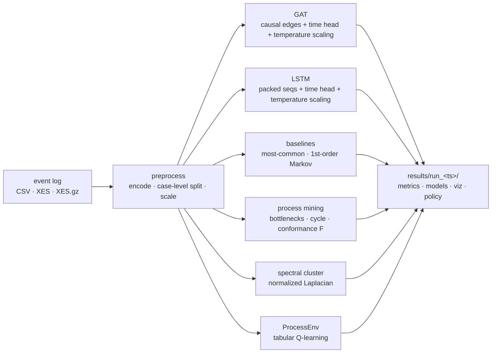

<div align="center">

# `gnn`

### process mining with graph neural networks

**Predict the next event. Find the bottleneck. Recommend the resource.**

One CLI, one event log, six questions answered.

[](https://github.com/erphq/gnn/actions/workflows/ci.yml)
[](https://github.com/erphq/gnn/actions/workflows/docker.yml)
[](./LICENSE)
[](#install)
[](./pm_fast)
[](./tests)
[](https://github.com/erphq/gnn/releases)

</div>

A modern toolkit for process mining that fuses classical algorithms — PM4Py
inductive miner, token-replay conformance, spectral clustering — with
**Graph Attention Networks**, **LSTMs**, and **tabular RL**, all wired
together by a single `gnn` CLI you can drop on any event log.

Built for the questions you actually ask: *where do cases get stuck?*,
*what happens next?*, *does reality match the discovered model?*,
*who should do the work?*

> **The thesis.** Process mining notebooks are easy to write and easy to
> get *subtly wrong* — leaky splits, scalers fit on validation, modal
> graph labels, complex-valued spectral. This repo's job is to be the
> opinionated, audited, batteries-included alternative: same algorithms,
> right by default, fast where it matters.

---

## ✦ The goal

If you have a workflow with timestamps — claims processing, customer
onboarding, hospital admissions, expense approvals, supply-chain handoffs,
incident management, *anything* logged as a sequence of events with case IDs
— you have an **event log**. The job of process mining is to take that log
and answer the six operational questions a process owner actually cares
about:

| # | Question | Command | What you get |
|---|---|---|---|
| 1 | Where do cases get stuck? | `gnn analyze log.csv` | Transitions ranked by mean wait time |
| 2 | Which cases are anomalous? | `gnn analyze log.csv` | Cases above the 95th-pct cycle time + rare paths |
| 3 | What happens next in this open case? | `gnn run log.csv` | Calibrated, ranked next-event predictions (top-3 ≈ 97% on BPI 2020) |
| 4 | Does reality match the model? | `gnn analyze log.csv` | Conformance fitness, precision, F-score (don't trust fitness alone) |
| 5 | Who should do what? | `gnn run log.csv` | Tabular Q-learning policy over `(task, resource)` |
| 6 | Are these activities really distinct? | `gnn cluster log.csv -k 3` | Spectral clusters of the task adjacency |

The point isn't to top a leaderboard on any single metric. It's to **answer
all six honestly, in one command, with enough reproducibility and calibration
that downstream decisions can trust the output** — instead of being a
notebook scaffold you reassemble each project from scratch.

---

## ✦ How

Drop in a CSV or XES, run one command:

```bash
gnn run my_log.csv          # full pipeline on a CSV event log
gnn run my_log.xes.gz       # or XES — pm4py importer auto-routes
```



Output is **one timestamped directory** per run with a `metrics/` tree of
JSON (one per stage), `models/` (best-val checkpoints + calibration scalars),
`visualizations/` (PNGs + an HTML Sankey), `analysis/` (process-mining
outputs), and `policies/` (RL output).

Each stage is also **independently runnable** when you only want one
(`gnn analyze`, `gnn cluster`, `gnn baseline`, `gnn explain --case-id <id>`)
and **individually skippable** when running the whole pipeline
(`--skip-{gat,lstm,analyze,viz,cluster,rl}`). Two runs can be diffed with
`gnn diff run_a/ run_b/`. Hyperparameters can be pinned in a
[TOML config](#-cli) so reproducible experiments don't need 15-flag command
lines.

Three things this gets right by default that off-the-shelf process-mining
notebooks routinely don't (full audit history under
[Correctness commitments](#-correctness-commitments)):

1. **Case-level train/val splits, never prefix-level.** No future-event
   leakage. Verified by a load-bearing regression test
   (`tests/test_models.py::test_prefixes_are_case_isolated`).
2. **Calibrated probabilities.** Post-hoc temperature scaling is run by
   default; ECE reported before and after.
3. **Honest baselines.** Every model accuracy is paired with
   `lift_over_markov` and `lift_over_most_common` so you can tell whether
   the deep model is adding signal or just inheriting the distribution's
   class imbalance.

---

## ✦ Benchmarks

> **TL;DR.** On the real-world **BPI 2020 Domestic Declarations** log (10,366
> cases, 17 task classes, 24 months of data), the LSTM ranks the next event
> in its **top-3 guesses 97.1%** of the time, with **MRR 0.898** and
> calibrated probabilities (ECE **0.011**). On synthetic data the same model
> hits **top-3 = 100%, MRR = 0.953**. Numbers below are from `gnn run --seed 42`
> and reproducible to the JSON.

### Next-event prediction — LSTM

| dataset | cases | tasks | most-common | Markov | top-1 | **top-3** | **top-5** | **MRR** | ECE¹ | dt MAE² |
|---|---:|---:|---:|---:|---:|---:|---:|---:|---:|---:|
| **BPI 2020 Domestic Declarations** (real industrial log) | 10,366 | 17 | 22.0% | 85.4% | 81.8% | **97.1%** | **99.8%** | **0.898** | **0.011** | 48.4 h |
| Synthetic Markov chain (Approve / Reject branching, bounded loops) | 500 | 8 | 23.2% | 92.0% | 90.5% | **100.0%** | **100.0%** | **0.953** | **0.018** | 0.43 h |

The right framing for next-event prediction isn't *"did the model nail the
exact next event?"* (top-1 — brutal across 17 classes), it's *"is the model's
shortlist trustworthy?"* (top-K, MRR, ECE).

- **Top-3 = 97.1% on real industrial data.** When the LSTM ranks candidates,
  the right answer is in its top 3 guesses 97 times out of 100.
- **MRR = 0.898.** The true next event is on average essentially rank-1 in
  the predicted ranking.
- **ECE = 0.011 after temperature scaling.** The predicted probabilities are
  *honest* — when the model says 80%, it's right ~80% of the time.
- **Top-1 81.8% is within 4 pp of the Markov ceiling (85.4%).** The 1st-order
  Markov baseline already captures most BPI structure; the LSTM matches it
  while also delivering ranked candidates and calibrated confidences.
- **Time-to-next-event MAE 48.4 h** on a process whose cycle times span days
  to weeks (95th percentile 596 h). Useful for SLA-style downstream uses.

¹ Expected Calibration Error after post-hoc temperature scaling, 15 bins. Lower is better; 0 is perfectly calibrated.
² Mean absolute error of the time-to-next-event regression head, in hours.

### Process-mining quality (PM4Py inductive miner + token replay)

| dataset | fitness | precision | F-score |
|---|---:|---:|---:|
| BPI 2020 Domestic Declarations | 1.000 | 0.247 | 0.396 |
| Synthetic Markov (500 cases) | 1.000 | 0.997 | 0.998 |

The BPI 2020 row is the **flower-model warning** the v0.4 audit was built to
surface: `fitness=1.0` (every event is reproducible by the discovered model)
combined with `precision=0.247` (the model also allows a lot of behavior the
log never showed) means the model fits everything because it permits
everything. The previous "deviant trace count" (0 / 10,366) alone called this
green; F-score 0.40 calls it what it is.

### Reproduce

```bash
# BPI 2020 LSTM row — Apple Silicon MPS ≈ 8 min, CPU ≈ 30 min.
gnn run input/BPI2020_DomesticDeclarations.csv \
    --seed 42 --device cpu \
    --epochs-lstm 30 --hidden-dim 256 --lr-lstm 5e-4 \
    --predict-time --skip-gat --skip-rl

# Synthetic row
gnn smoke --num-cases 500 --seed 42 --device cpu \
    --epochs-lstm 30 --hidden-dim 128 --lr-lstm 5e-4 \
    --predict-time --skip-gat --skip-rl
```

Each command writes a full metrics tree under `results/run_<timestamp>/`. To
compare two runs (e.g. before/after a change), use `gnn diff run_a/ run_b/`.
The exact JSON files behind the tables above are committed under
[`bench/published/`](./bench/published/) (model weights and visualizations are
kept out of git; run the commands locally to regenerate).

> **What's next on the leaderboard.** GAT in the current configuration
> reaches top-1 66% on BPI 2020 at 60 epochs but collapses on short-sequence
> synthetic data — a known graph-attention failure mode for tiny graphs.
> Closing the GAT/LSTM gap and adding multi-dataset coverage (BPI 2012, 2017,
> 2019; Hospital Sepsis) is the [v0.5 milestone](./GOALS.md).

---

## ✦ Try it in 60 seconds

```bash
git clone https://github.com/erphq/gnn && cd gnn

python -m venv .venv && source .venv/bin/activate
pip install --index-url https://download.pytorch.org/whl/cpu torch
pip install -r requirements.txt && pip install -e .

gnn smoke      # synthetic data, full pipeline, no internet, no GPU
```

Trained GAT + LSTM weights, conformance reports, a Plotly Sankey, spectral
task clusters, and an RL policy — in under a minute.

Pointing at real data is one line:

```bash
gnn run input/BPI2020_DomesticDeclarations.csv
```

Don't want a Python env? Pull the image:

```bash
docker run --rm -it ghcr.io/erphq/gnn:main gnn smoke
```

---

## ✦ Fast where it matters

The two per-case Python loops that dominated wall-clock time are now
Rust kernels (PyO3 + maturin). On a synthetic log of 5,000 cases / 37,651
rows on Apple silicon:

| function                   | Python    | Rust        | speedup  |
|----------------------------|-----------|-------------|----------|
| `build_task_adjacency`     | 396.31 ms | **0.67 ms** | **588×** |
| `build_padded_prefixes`    | 396.27 ms | **0.78 ms** | **505×** |

```text
build_task_adjacency
  Python │ ████████████████████████████████████████ 396.31 ms
  Rust   │ ▏ 0.67 ms                                          (588×)

build_padded_prefixes
  Python │ ████████████████████████████████████████ 396.27 ms
  Rust   │ ▏ 0.78 ms                                          (505×)
```

Reproduce with `python bench/bench_hotpaths.py --num-cases 5000`. The
extension is **optional** — the pipeline auto-detects it and falls back
to pure Python if it isn't built. CI builds the extension and asserts
byte-identical output against the reference. Details in
[`pm_fast/README.md`](./pm_fast/README.md).

GAT / LSTM training stays in PyTorch — those already call into BLAS /
cuDNN, so there's nothing for Rust to win. Profile, then push only the
genuinely hot Python loops down to native.

---

## ✦ Install

```bash
git clone https://github.com/erphq/gnn
cd gnn

python -m venv .venv && source .venv/bin/activate
pip install --index-url https://download.pytorch.org/whl/cpu torch  # or a CUDA wheel
pip install -r requirements.txt
pip install -e .            # exposes the `gnn` CLI on $PATH
```

<details>
<summary><b>Optional — Rust hot-path kernels (500×+ speedup)</b></summary>

```bash
pip install maturin
cd pm_fast && maturin develop --release && cd ..
```

Or, if you don't have a venv (e.g. CI):

```bash
pip install maturin
cd pm_fast && maturin build --release --out dist && pip install dist/*.whl
```

The Python pipeline imports `pm_fast` lazily; if it isn't installed,
everything falls through to pure-Python loops with no behavior change.

</details>

<details>
<summary><b>Docker (Rust kernels included)</b></summary>

```bash
docker run --rm -it ghcr.io/erphq/gnn:main gnn smoke
docker run --rm -it -v $(pwd)/input:/app/input ghcr.io/erphq/gnn:main \
    gnn run input/BPI2020_DomesticDeclarations.csv
```

Tags published: `:main`, `:sha-<short>`, and on releases `:X.Y.Z`,
`:X.Y`, `:latest`.

</details>

---

## ✦ Data format

CSV with one row per event:

| column      | type      | description                                  |
|-------------|-----------|----------------------------------------------|
| `case_id`   | string    | process-instance identifier                  |
| `task_name` | string    | activity / event name                        |
| `timestamp` | datetime  | event time (any pandas-parseable format)     |
| `resource`  | string    | resource / actor that performed the event    |
| `amount`    | numeric   | numerical attribute (optional but expected)  |

XES-style column names (`case:concept:name`, `concept:name`,
`time:timestamp`, `org:resource`, `case:Amount`) are accepted and
auto-renamed; collisions are resolved by priority so BPI logs that ship
both `case:id` and `case:concept:name` Just Work.

---

## ✦ CLI

After `pip install -e .`:

```text
gnn <command> [options]

  smoke                 synthetic data, ~1 min end-to-end
  run     LOG.csv       full pipeline
  analyze LOG.csv       process-mining stats only
  cluster LOG.csv -k N  spectral clustering only
  version               print version and exit
```

`gnn run --help` lists every flag. The ones you'll actually reach for:

```bash
gnn run input/BPI2020_DomesticDeclarations.csv \
  --epochs-gat 30 --epochs-lstm 10 \
  --hidden-dim 128 --gat-heads 8 \
  --val-frac 0.2 --seed 42 \
  --skip-rl                                # any stage can be skipped:
                                           # --skip-{gat,lstm,analyze,viz,cluster,rl}
```

<details>
<summary><b>Full flag reference</b></summary>

| flag                  | default   | meaning                                         |
|-----------------------|-----------|-------------------------------------------------|
| `--out-dir`           | `results` | root directory for run output                   |
| `--seed`              | `42`      | global RNG seed (covers torch / numpy / random / cudnn) |
| `--device`            | auto      | force `cpu` / `cuda` / `mps`                    |
| `--val-frac`          | `0.2`     | fraction of cases held out for validation       |
| `--batch-size-gat`    | `32`      | GAT minibatch size                              |
| `--batch-size-lstm`   | `64`      | LSTM minibatch size                             |
| `--epochs-gat`        | `20`      | GAT training epochs                             |
| `--epochs-lstm`       | `5`       | LSTM training epochs                            |
| `--lr-gat`            | `5e-4`    | GAT learning rate (AdamW)                       |
| `--lr-lstm`           | `1e-3`    | LSTM learning rate (Adam)                       |
| `--hidden-dim`        | `64`      | hidden width (shared by GAT / LSTM)             |
| `--gat-heads`         | `4`       | GAT attention heads                             |
| `--gat-layers`        | `2`       | GAT layers                                      |
| `--rl-episodes`       | `30`      | Q-learning episodes                             |
| `--clusters`          | `3`       | spectral cluster count `k`                      |
| `--gat-graph-label`   | off       | use the legacy graph-level head (v0.2 reproducibility) |
| `--skip-{stage}`      | —         | skip any of: `gat lstm analyze viz cluster rl`  |

</details>

The legacy entry point still works:

```bash
python main.py input/BPI2020_DomesticDeclarations.csv
```

### Output layout

```text
results/run_YYYYMMDD_HHMMSS/
├── models/             # GAT + LSTM weights (best-val for GAT)
├── visualizations/     # PNGs + an HTML Plotly Sankey
├── metrics/            # JSON: per-stage metrics, scaler mode, seed, splits
├── analysis/           # process-mining outputs
└── policies/           # learned RL policy
```

### Exit codes

| code | meaning |
|------|---------|
| `0`  | success |
| `2`  | usage error (bad args / value out of range) |
| `3`  | data error (missing file, bad columns, unparseable timestamps) |
| `4`  | runtime error (model / training crash) |

---

## ✦ What's in the box

```text
.
├── input/                       # sample event logs (BPI 2020 included)
├── gnn_cli/                     # `gnn` CLI: argparse, stage orchestration, smoke generator
│   ├── cli.py                   #   subcommands: run / analyze / cluster / smoke / version
│   ├── stages.py                #   pipeline stages, each callable in isolation
│   └── smoke.py                 #   synthetic event-log generator
├── models/
│   ├── gat_model.py             # Graph Attention Network — node-level next-task head
│   └── lstm_model.py            # LSTM next-activity model with packed sequences
├── modules/
│   ├── data_preprocessing.py    # encoders, scalers, case-level split, PyG graphs
│   ├── process_mining.py        # bottlenecks, conformance, transitions, spectral
│   ├── rl_optimization.py       # tabular Q-learning over (task, resource) actions
│   ├── _fast.py                 # bridge: prefer pm_fast Rust kernels when installed
│   └── utils.py                 # set_seed(), pick_device()
├── visualization/
│   └── process_viz.py           # confusion matrix, Sankey, transition heatmap, …
├── pm_fast/                     # Rust hot-path kernels (PyO3, optional 500×+ speedup)
│   ├── src/lib.rs               #   build_task_adjacency, build_padded_prefixes
│   ├── python/pm_fast/          #   df → numpy adapter + extension import
│   └── Cargo.toml               #   pyo3 0.22, abi3-py310, fat LTO
├── bench/                       # benchmark scripts (Python vs Rust)
├── tests/                       # pytest suite, synthetic event-log fixtures
├── .github/workflows/           # ci.yml (ruff + pytest + Rust), docker.yml (ghcr)
├── pyproject.toml               # project metadata, `gnn` script, ruff + pytest config
└── main.py                      # legacy entry point (delegates to gnn_cli)
```

---

## ✦ Capability surface

```text
       ┌──────────────────────────────────────────────────────┐
       │ Process analysis  │ Models      │ Optimization        │
       ├───────────────────┼─────────────┼─────────────────────┤
       │ bottlenecks       │ GAT (PyG)   │ Q-learning          │
       │ cycle-time stats  │ LSTM        │ ProcessEnv          │
       │ rare transitions  │ node head   │ (task, resource)    │
       │ conformance (PM4Py)│            │                     │
       │ inductive miner   │             │                     │
       │ token replay      │             │                     │
       └───────────────────┴─────────────┴─────────────────────┘
                                │
                                ▼
       ┌──────────────────────────────────────────────────────┐
       │  Spectral clustering   │  Visualization              │
       ├────────────────────────┼─────────────────────────────┤
       │ normalized Laplacian   │ confusion matrix             │
       │ eigh + KMeans          │ cycle-time histogram         │
       │ isolated-node safe     │ NetworkX flow + bottlenecks  │
       │                        │ transition heatmap           │
       │                        │ Plotly Sankey                │
       └────────────────────────┴─────────────────────────────┘
```

---

## ✦ Correctness commitments

This codebase has been audited twice and ships every fix with a
regression test. Here's what we got right that off-the-shelf process-
mining notebooks routinely get wrong:

### v0.2 audit — methodology

1. **Case-level train/val split.** The LSTM pipeline used to shuffle
   *prefixes* before the 80/20 split, so future events of the same case
   ended up in both halves. Splits now happen on `case_id` first;
   prefixes are built only within each half. See
   `tests/test_models.py::test_prefixes_are_case_isolated` —
   **do not relax it**.
2. **Train-only scaler fit.** `MinMaxScaler` / `Normalizer` are fit on
   training rows only, then applied to validation rows. Label encoders
   for tasks / resources still fit on the full dataframe (a stable
   label space is needed across splits).
3. **Normalized Laplacian for spectral clustering.** The unnormalized
   Laplacian + `np.linalg.eig` returned complex eigenvectors and
   produced unstable clusters when task degrees were skewed. We now
   symmetrize the adjacency, build the normalized Laplacian, and use
   `np.linalg.eigh` — real, ascending, faster.

### v0.3 audit — model + ergonomics

4. **Node-level GAT head (default).** The GAT now predicts next-task
   at every event (`shape=(total_nodes, num_classes)`) instead of
   pooling to a single graph-level prediction supervised by the modal
   next-task. The legacy graph-level head is kept behind
   `--gat-graph-label` for v0.2 reproducibility.
5. **RL state-vector sizing.** `ProcessEnv._get_state` previously
   sized the one-hot state by `len(all_tasks)` (the subset of task-ids
   appearing as transition sources after `dropna(next_task)`) but
   indexed it with `current_task` from the full label space. Tasks
   that only appear as terminal events crashed it. Sized by
   `len(le_task.classes_)` now.
6. **Priority-based XES alias rename.** BPI logs ship both `case:id`
   and `case:concept:name`, and the previous rename map collapsed both
   to `case_id`, producing a duplicate-named column that broke
   `df["case_id"]` access. The loader now picks the highest-priority
   alias and drops collisions.

### Reproducibility

`modules.utils.set_seed` seeds `random`, `numpy`, `torch` (CPU + CUDA),
and toggles `cudnn.deterministic`. Always call it — never reach for
`torch.manual_seed` directly.

---

## ✦ Tests

```bash
pytest -q
```

24 tests covering preprocessing, splits, scaler fit/apply, both model
forward + backward passes (node-level **and** legacy graph-level), the
RL env contract, a known-bipartite-graph regression for spectral
clustering, and a parity test for the Rust kernels. Synthetic
event-log fixture in `tests/conftest.py`; no external data needed.

CI matrix: Python `3.10` / `3.11` × `{lint, test, rust}`.

---

## ✦ Roadmap

A working draft of where this is going lives in [GOALS.md](./GOALS.md).
Headlines:

**Near term — v0.4 → v0.5**
- Native XES ingestion (currently CSV-only)
- ONNX export for GAT + LSTM
- Multi-BPI benchmark harness (`gnn bench --suite bpi`)
- Per-case explanations: top-k attention edges that drove a prediction

**Medium term — v0.6 → v1.0**
- Streaming mode for incremental event ingestion
- Citable benchmarks doc (preregistered protocol)
- A Rust orchestration layer that calls into PyTorch (only if profiling justifies it — Option B in the design discussion)
- Optional DGL backend behind a flag

**Explicit non-goals**
- Reimplementing PM4Py in Rust (it's a research project on its own)
- A managed cloud service — this is a library + CLI

---

## ✦ FAQ

<details>
<summary><b>Why CSV instead of XES?</b></summary>

XES is the canonical process-mining format and it's on the roadmap.
Today CSV with the auto-rename for XES-style columns covers every BPI
release we've tested, with a much smaller dependency surface.

</details>

<details>
<summary><b>Why not just use PM4Py for everything?</b></summary>

PM4Py is excellent and we use it for inductive miner + token replay.
But its native predictive layer (LSTM, etc.) doesn't expose a graph
view. For next-event prediction, GAT-on-per-case-graph is the right
shape; that's what this repo adds.

</details>

<details>
<summary><b>Do I need a GPU?</b></summary>

No. The whole pipeline runs on CPU in under a minute for the BPI
samples; the default Docker image is CPU-torch. Use a CUDA wheel + set
`--device cuda` if your dataset is large.

</details>

<details>
<summary><b>Why is `pm_fast` optional?</b></summary>

So `pip install -r requirements.txt` works without a Rust toolchain.
The Python paths are the reference implementation and stay byte-identical
to the Rust kernels (CI asserts parity). The Rust path is a 500×+ speedup
on per-case loops — but if you can't install Rust on a particular
system, everything still works.

</details>

<details>
<summary><b>Why two GAT heads?</b></summary>

The node-level head is the right answer for next-event prediction; the
graph-level head exists for back-compatibility with v0.2 numbers. Use
`--gat-graph-label` to reproduce a v0.2 run exactly.

</details>

<details>
<summary><b>Can I use this commercially?</b></summary>

Yes — MIT-licensed. Citation is appreciated but not required. See
[Citation](#-citation) below.

</details>

---

## ✦ Authors

Built by **Somesh Misra** ([@mathprobro](https://x.com/mathprobro)) and
**Shashank Dixit** ([@protosphinx](https://x.com/protosphinx)) at
[ERP•AI Research](https://www.erp.ai).

## ✦ Acknowledgments

- **[@adamya-singh](https://github.com/adamya-singh)** — spotted the
  `torch.tensor(list)` slow-conversion warning and the original fix
  ([#8](https://github.com/erphq/gnn/pull/8) → re-applied in
  [#17](https://github.com/erphq/gnn/pull/17) on top of the audit).
- **PM4Py** — inductive miner + token replay backbone.
- **PyG (PyTorch Geometric)** — the GAT layers and graph batching.
- **maturin / PyO3 / numpy crate** — what makes the Rust hot-path
  ergonomic enough to be worth doing.

## ✦ Citation

```bibtex
@software{GNN_ProcessMining,
  author    = {Misra, Somesh and Dixit, Shashank},
  title     = {Process Mining with Graph Neural Networks},
  year      = {2025},
  publisher = {ERP•AI},
  url       = {https://github.com/erphq/gnn}
}
```

## ✦ License

MIT — see [LICENSE](./LICENSE).

<div align="center">
<sub>
Built with care in San Francisco · Audited twice · 24 tests, two CI workflows, one CLI
</sub>
</div>
